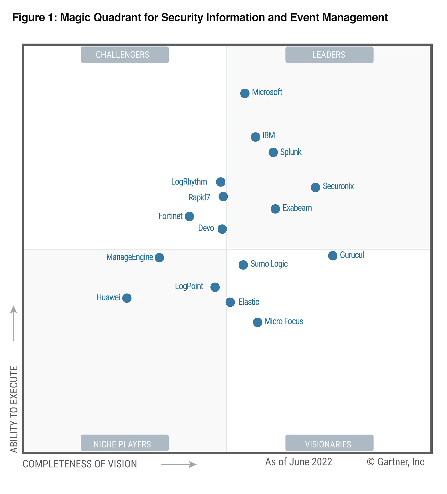

# SIEM Components, Features, Constraints
- Data models, compatibility, or normalization approaches and/or logic
- Query language/syntax, building analytics?
	- Sigma rules?
- Infrastructure model and approach?
- Detection Engineering
	- Machine Learning and AI 
		- Anomaly Detection Models
		- Types of functions
		- Correlation
	- Community Marketplace / Database for Queries/Detections

# Tech Stacks & Architectures

# Curated Solutions
## Research & Consulting
- SIEM Matrices
	- 
## Curated Lists
- [correlatedsecurity/Awesome-SOAR: A curated Cyber "Security Orchestration, Automation and Response (SOAR)" awesome list.](https://github.com/correlatedsecurity/Awesome-SOAR) 
- https://github.com/meirwah/awesome-incident-response#playbooks 
- https://github.com/Correia-jpv/fucking-awesome-incident-response#playbooks 
- https://github.com/cyb3rxp/awesome-soc/blob/main/README.md 
- https://github.com/cyb3rxp/awesome-soc/blob/main/threat_intelligence.md 
- https://github.com/academic/awesome-datascience#miscellaneous-tools 
- https://github.com/academic/awesome-datascience#visualization-tools 
- https://github.com/igorbarinov/awesome-data-engineering#databases 
- https://github.com/igorbarinov/awesome-data-engineering#data-ingestion 
- https://github.com/igorbarinov/awesome-data-engineering#workflow 
- https://github.com/igorbarinov/awesome-data-engineering#data-lake-management 
- https://github.com/igorbarinov/awesome-data-engineering#elk-elastic-logstash-kibana 
- https://github.com/newTendermint/awesome-bigdata#data-ingestion 
- https://github.com/newTendermint/awesome-bigdata#data-visualization 
- https://github.com/0x4D31/awesome-threat-detection#detection-alerting-and-automation-platforms
- https://github.com/LetsDefend/awesome-soc-analyst#network-devices-logs 
- https://github.com/pawl/awesome-etl 
## Acronyms
- SIEM - aggregating data and doing analysis
- SOAR - logic to react to analysis (integrates with SIEM)
	- SOAR tools are a combination of threat intelligence platforms, Security Incident Response Platforms (SIRP) and Security Orchestration and Automation (SOA).
- SIRP - security incident response platform
- TIP - threat intel platform
## Security-Focused (SIEM, SIRP)
### search terms
- .
### Open-Source
- [matanolabs/matano: Open source cloud-native security lake platform (SIEM alternative) for threat hunting, detection & response, and cybersecurity analytics at petabyte scale on AWS](https://github.com/matanolabs/matano) 
- [TheHive Project](http://thehive-project.org/) 
### Proprietary
- [Gurucul | Global Leader in Advanced Cybersecurity Solutions](https://gurucul.com/?utm_adgroup=%7Badgroup%7D&utm_term=gurucul) 
- [Microsoft Sentinel - Cloud SIEM Solution | Microsoft Security](https://www.microsoft.com/en-us/security/business/siem-and-xdr/microsoft-sentinel)
- [Dynatrace | Modern cloud done right](https://www.dynatrace.com/) 
- [Cloud Log Management, Monitoring, SIEM Tools | Sumo Logic](https://www.sumologic.com/) 
- [Graylog: Industry Leading Log Management & SIEM](https://graylog.org/) 
- 
## Innovative, Unorthodox Visibility and Analysis (not marketed for security)
### search terms
- General Data Engineering, Storage, Analytics, Visualization?
	- multi-language, agnostic analytics engine 
	- data engineering platform
	- distributed data analytics
	- data warehouse analytics
	- data lake analytics
- 
### Open-Source
- 
### Cloud - Proprietary
- General Data Engineering, Storage, Analytics, Visualization?
	- [Data Lakehouse Architecture and AI Company | Databricks](https://www.databricks.com/) 
		- Platform for working with Apache Spark.
		- Automated infra management
		- Microsoft Azure Databricks (integrated into Azure)
	- Teradata?
	- Qubole?
	- Domo?
	- [Datadog Log Management | Datadog](https://www.datadoghq.com/dg/logs/benefits/)
	- 

- Databases, Data Storage, Data Indexing
	- .

- Automation, IFTTT
	- 

- Analytics & Visualization
	- [Grafana: The open observability platform | Grafana Labs](https://grafana.com/) 

- Data Ingestion & Aggregation
	- [Grafana Loki OSS | Log aggregation system](https://grafana.com/oss/loki/)
		- [grafana/loki: Like Prometheus, but for logs.](https://github.com/grafana/loki)
## Threat Intel?
### Open Source
- [MISP Open Source Threat Intelligence Platform &amp; Open Standards For Threat Information Sharing](https://www.misp-project.org/) 
### Cloud - Proprietary
- .
## SOAR - Security Orchestration, Automation, and Response
### search terms
- Automated Incident Response
- Incident Handling
- Security Automation
- IFTTT
### Open-Source
- TheHive
	- [TheHive-Project/Cortex: Cortex: a Powerful Observable Analysis and Active Response Engine](https://github.com/TheHive-Project/Cortex) 
- [nsacyber/WALKOFF: A flexible, easy to use, automation framework allowing users to integrate their capabilities and devices to cut through the repetitive, tedious tasks slowing them down. #nsacyber](https://github.com/nsacyber/WALKOFF)
### Cloud - Proprietary
- [Tines | Smart, secure workflows](https://www.tines.com/) 
- [Shuffle Automation - An Open Source SOAR solution](https://shuffler.io/)
- [SIRP SOAR Platform: Security Automation at Lightning Speed](https://www.sirp.io/) 
- [Chronicle | Suite | SOAR](https://chronicle.security/suite/soar/) 
- [Devo SOAR -](https://www.devo.com/resources/solution-brief/devo-soar/) 
- [Top Security Orchestration and Response (SOAR) Software](https://www.fortinet.com/products/fortisoar) 
- [IBM Security QRadar SOAR](https://www.ibm.com/products/qradar-soar)
- [What is SOAR (Security Orchestration, Automation, and Response) - Service Now](https://www.servicenow.com/products/security-operations/what-is-soar.html) 
- [AI Enabled Security Automation, SOC Automation, SOAR](https://swimlane.com/) 
- [Streamlined and Converged Cyber Security - Logpoint](https://www.logpoint.com/en/) 
- 
- For specific systems:
	- [Intelligent Threat Detection - Amazon GuardDuty - AWS](https://aws.amazon.com/guardduty/) 
# Fundamental Security Visibility & Data Engineering

